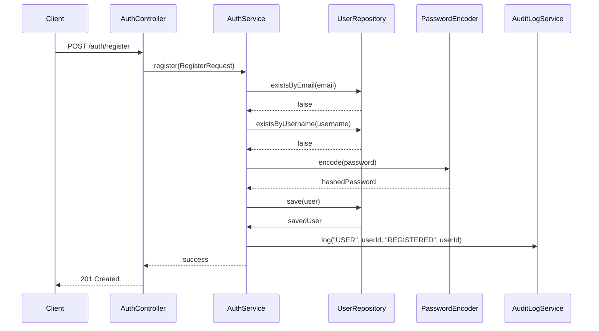
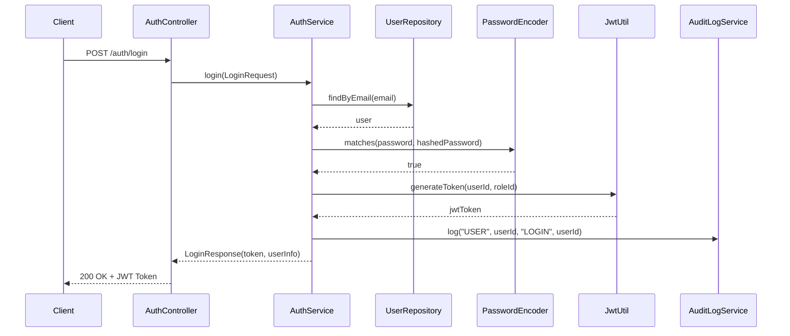
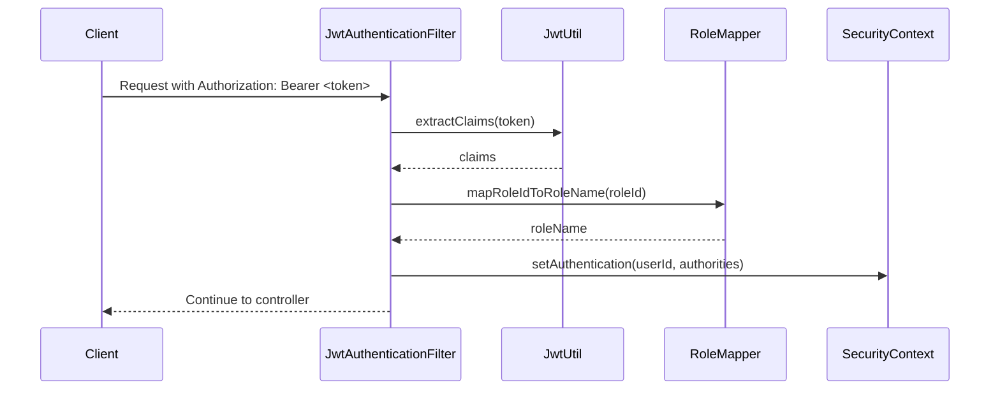

# Spring Security Implementation Guide - Job Tracking Application

## Table of Contents
1. [Overview](#overview)
2. [Architecture](#architecture)
3. [Security Configuration](#security-configuration)
4. [JWT Implementation](#jwt-implementation)
5. [Authentication Flow](#authentication-flow)
6. [Authorization Strategy](#authorization-strategy)
7. [Security Features](#security-features)
8. [Best Practices](#best-practices)
9. [Interview Questions & Answers](#interview-questions--answers)
10. [Common Security Vulnerabilities](#common-security-vulnerabilities)
11. [Performance Considerations](#performance-considerations)
12. [Testing Security](#testing-security)

## Overview

This Spring Security implementation provides comprehensive security for a job tracking application with role-based access control (RBAC), JWT authentication, and stateless session management. The system supports three user roles: ADMIN, RECRUITER, and JOB_SEEKER.

### Key Security Features
- JWT-based stateless authentication
- Role-based authorization (RBAC)
- CORS configuration for cross-origin requests
- Password encryption using BCrypt
- Method-level security
- Audit logging for security events
- Data masking for sensitive information
- Custom exception handling for security violations

## Architecture

### Security Components
```
┌─────────────────┐    ┌──────────────────┐    ┌─────────────────┐
│   Client        │    │  Security Filter │    │   Controller    │
│   (Frontend)    │───▶│     Chain        │───▶│   (Protected)   │
└─────────────────┘    └──────────────────┘    └─────────────────┘
                              │
                              ▼
                       ┌──────────────────┐
                       │ JWT Auth Filter  │
                       │ (Custom)         │
                       └──────────────────┘
                              │
                              ▼
                       ┌──────────────────┐
                       │ Security Context │
                       │ (Authentication) │
                       └──────────────────┘
```

### Role Hierarchy
```
ADMIN (roleId: 1)
├── Full system access
├── User management
├── System statistics
└── Audit logs

RECRUITER (roleId: 2)
├── Job management
├── Application management
├── Organization management
└── Recruiter dashboard

JOB_SEEKER (roleId: 3)
├── Job browsing
├── Application submission
├── Profile management
└── Application tracking
```

## Security Configuration

### Main Security Configuration (`SecurityConfig.java`)

```java
@Configuration
@EnableMethodSecurity
public class SecurityConfig {
    
    @Bean
    SecurityFilterChain securityFilterChain(HttpSecurity http) throws Exception {
        return http
            .cors(cors -> cors.configurationSource(corsConfigurationSource()))
            .csrf(csrf -> csrf.disable())
            .httpBasic(httpBasic -> httpBasic.disable())
            .formLogin(form -> form.disable())
            .sessionManagement(session -> session
                .sessionCreationPolicy(SessionCreationPolicy.STATELESS))
            .authorizeHttpRequests(this::configureAuthorization)
            .addFilterBefore(jwtAuthenticationFilter, 
                UsernamePasswordAuthenticationFilter.class)
            .build();
    }
}
```

### Key Configuration Decisions

1. **Stateless Sessions**: `SessionCreationPolicy.STATELESS`
   - No server-side session storage
   - Improved scalability
   - JWT tokens carry all necessary information

2. **CSRF Disabled**: Safe for stateless JWT authentication
   - CSRF attacks target session-based authentication
   - JWT tokens in Authorization headers are not vulnerable to CSRF

3. **CORS Configuration**: Explicit allowed origins and methods
   - Prevents unauthorized cross-origin requests
   - Supports development and production environments
## JWT Implementation

### JWT Utility Class (`JwtUtil.java`)

The JWT implementation uses HMAC-SHA256 signing algorithm with the following features:

```java
@Component
public class JwtUtil {
    
    @Value("${jwt.secret}")
    private String secret;
    
    @Value("${jwt.expiration-ms}")
    private long expirationMs; // 24 hours (86400000 ms)
    
    public String generateToken(Long userId, Integer roleId) {
        return Jwts.builder()
            .subject(userId.toString())
            .claim("roleId", roleId)
            .issuedAt(new Date())
            .expiration(new Date(System.currentTimeMillis() + expirationMs))
            .signWith(getSigningKey())
            .compact();
    }
}
```

### JWT Token Structure

**Header:**
```json
{
  "alg": "HS256",
  "typ": "JWT"
}
```

**Payload:**
```json
{
  "sub": "123",           // User ID
  "roleId": 2,            // Role identifier
  "iat": 1640995200,      // Issued at
  "exp": 1641081600       // Expiration
}
```

**Signature:**
```
HMACSHA256(
  base64UrlEncode(header) + "." +
  base64UrlEncode(payload),
  secret
)
```

### JWT Security Considerations

1. **Secret Key Management**
   - Stored in environment variables
   - Minimum 256-bit key for HS256
   - Never hardcoded in source code

2. **Token Expiration**
   - 24-hour expiration for security
   - Automatic cleanup of expired tokens
   - Refresh token strategy can be implemented

3. **Claims Validation**
   - Subject (user ID) validation
   - Expiration time checking
   - Signature verification

## Authentication Flow

### Registration Process



### Login Process



### Request Authentication



## Authorization Strategy

### URL-Based Authorization

The security configuration defines granular access control:

```java
.authorizeHttpRequests(auth -> auth
    // Public endpoints
    .requestMatchers("/auth/register", "/auth/login").permitAll()
    .requestMatchers(HttpMethod.GET, "/jobs", "/jobs/**").permitAll()
    
    // Role-specific endpoints
    .requestMatchers("/admin/**").hasRole("ADMIN")
    .requestMatchers("/recruiter/jobs/**").hasRole("RECRUITER")
    .requestMatchers("/applications/me").hasRole("JOB_SEEKER")
    
    // Authenticated endpoints
    .requestMatchers("/dashboard/**").authenticated()
    .anyRequest().authenticated()
)
```

### Method-Level Security

Enabled through `@EnableMethodSecurity` annotation:

```java
@PreAuthorize("hasRole('ADMIN')")
public AdminStatsResponse getSystemStats() {
    // Admin-only functionality
}

@PreAuthorize("hasRole('RECRUITER') and @authorizationUtil.isRecruiterAuthorizedForJob(authentication.name, #jobId)")
public JobResponse updateJob(@PathVariable Long jobId, @RequestBody UpdateJobRequest request) {
    // Recruiter can only update their own jobs
}
```

### Custom Authorization Logic

The `AuthorizationUtil` class provides centralized authorization checks:

```java
@Component
@RequiredArgsConstructor
public class AuthorizationUtil {
    
    public boolean isRecruiterAuthorizedForJob(Long recruiterId, Long jobId) {
        return jobRepository.findById(jobId)
            .map(job -> {
                Long jobRecruiterId = job.getRecruiter().getUser().getId();
                Long companyId = job.getCompany().getId();
                return recruiterId.equals(jobRecruiterId) && 
                       verificationService.isOrganizationVerified(companyId);
            })
            .orElse(false);
    }
}
```

## Security Features

### 1. Password Security

**BCrypt Password Encoding:**
```java
@Bean
PasswordEncoder passwordEncoder() {
    return new BCryptPasswordEncoder();
}
```

**Benefits:**
- Adaptive hashing function
- Built-in salt generation
- Configurable work factor (default: 10)
- Resistant to rainbow table attacks

### 2. Data Masking

Sensitive data is masked in responses:

```java
public class DataMaskingUtil {
    public static String maskEmail(String email) {
        if (email == null || !email.contains("@")) return "***";
        String[] parts = email.split("@");
        return parts[0].charAt(0) + "***@" + parts[1];
    }
    
    public static String createDisplayName(String fullName) {
        if (fullName == null) return "User";
        String[] parts = fullName.trim().split("\\s+");
        return parts.length > 1 ? 
            parts[0] + " " + parts[parts.length - 1].charAt(0) + "." : 
            parts[0];
    }
}
```

### 3. Audit Logging

All security-related events are logged:

```java
@Service
public class AuditLogService {
    public void log(String entityType, Long entityId, String action, Long userId) {
        AuditLog auditLog = AuditLog.builder()
            .entityType(entityType)
            .entityId(entityId)
            .action(action)
            .userId(userId)
            .timestamp(LocalDateTime.now())
            .ipAddress(getCurrentUserIP())
            .build();
        
        auditLogRepository.save(auditLog);
    }
}
```

### 4. CORS Configuration

Explicit CORS setup for security:

```java
@Bean
CorsConfigurationSource corsConfigurationSource() {
    CorsConfiguration config = new CorsConfiguration();
    config.setAllowedOrigins(List.of(
        "http://localhost:5173",  // Vite development
        "http://localhost:3000",  // React development
        "https://jobsync.vivekbhosale.in"  // Production
    ));
    config.setAllowedMethods(List.of("GET", "POST", "PUT", "PATCH", "DELETE", "OPTIONS"));
    config.setAllowedHeaders(List.of("Authorization", "Content-Type", "Accept"));
    config.setAllowCredentials(true);
    
    UrlBasedCorsConfigurationSource source = new UrlBasedCorsConfigurationSource();
    source.registerCorsConfiguration("/**", config);
    return source;
}
```

### 5. Exception Handling

Comprehensive security exception handling:

```java
@RestControllerAdvice
public class GlobalExceptionHandler {
    
    @ExceptionHandler(AuthorizationException.class)
    public ResponseEntity<ApiResponse<Object>> handleAuthorizationException(AuthorizationException ex) {
        logger.warn("Authorization failed: {}", ex.getMessage());
        return ResponseUtil.forbidden(ex.getMessage());
    }
    
    @ExceptionHandler(AccessDeniedException.class)
    public ResponseEntity<ApiResponse<Object>> handleAccessDeniedException(AccessDeniedException ex) {
        logger.warn("Access denied: {}", ex.getMessage());
        return ResponseUtil.forbidden("Access denied");
    }
    
    @ExceptionHandler(BadCredentialsException.class)
    public ResponseEntity<ApiResponse<Object>> handleBadCredentialsException(BadCredentialsException ex) {
        logger.warn("Bad credentials: {}", ex.getMessage());
        return ResponseUtil.unauthorized("Invalid credentials");
    }
}
```
## Best Practices

### 1. Security Configuration Best Practices

- **Principle of Least Privilege**: Users get minimum required permissions
- **Defense in Depth**: Multiple security layers (authentication, authorization, validation)
- **Fail Secure**: Default deny policy for unauthorized requests
- **Stateless Design**: No server-side session dependencies

### 2. JWT Best Practices

- **Short Expiration Times**: 24-hour token lifetime
- **Secure Secret Management**: Environment-based secret storage
- **Proper Claims**: Minimal necessary information in payload
- **Signature Verification**: Always validate token signatures

### 3. Password Security Best Practices

- **Strong Hashing**: BCrypt with appropriate work factor
- **No Plain Text Storage**: Never store raw passwords
- **Salt Generation**: Automatic salt generation with BCrypt
- **Password Policies**: Enforce strong password requirements

### 4. Authorization Best Practices

- **Centralized Logic**: AuthorizationUtil for consistent checks
- **Method-Level Security**: Fine-grained access control
- **Resource Ownership**: Users can only access their own resources
- **Role-Based Access**: Clear role separation and permissions

## Interview Questions & Answers

### Basic Spring Security Questions

**Q1: What is Spring Security and why is it important?**

**Answer:** Spring Security is a comprehensive security framework for Java applications that provides authentication, authorization, and protection against common security vulnerabilities. It's important because:

- **Declarative Security**: Configure security through annotations and configuration classes
- **Comprehensive Protection**: Handles authentication, authorization, CSRF, session management
- **Integration**: Seamlessly integrates with Spring ecosystem
- **Customizable**: Highly configurable for specific requirements
- **Industry Standard**: Widely adopted and well-maintained framework

**Q2: Explain the difference between authentication and authorization.**

**Answer:**
- **Authentication**: "Who are you?" - Verifying user identity through credentials (username/password, tokens, certificates)
- **Authorization**: "What can you do?" - Determining what resources/actions an authenticated user can access

In our implementation:
- Authentication: JWT token validation in `JwtAuthenticationFilter`
- Authorization: Role-based access control in `SecurityConfig` and method-level security

**Q3: What is the Security Filter Chain in Spring Security?**

**Answer:** The Security Filter Chain is a series of filters that process incoming HTTP requests for security purposes. Each filter has a specific responsibility:

```java
// Our filter chain order:
1. CorsFilter (CORS handling)
2. CsrfFilter (disabled for JWT)
3. JwtAuthenticationFilter (custom JWT processing)
4. UsernamePasswordAuthenticationFilter (standard auth)
5. FilterSecurityInterceptor (authorization)
```

**Q4: How does JWT authentication work in your application?**

**Answer:** Our JWT authentication follows this flow:

1. **Login**: User provides credentials → Server validates → Generates JWT token
2. **Token Structure**: Header.Payload.Signature with user ID and role
3. **Request Processing**: Client sends token in Authorization header
4. **Validation**: `JwtAuthenticationFilter` validates token and sets SecurityContext
5. **Authorization**: Spring Security uses authentication for access control

```java
// Token generation
String token = jwtUtil.generateToken(user.getId(), user.getRoleId());

// Token validation
Claims claims = jwtUtil.extractClaims(token);
Long userId = Long.parseLong(claims.getSubject());
Integer roleId = claims.get("roleId", Integer.class);
```

### Intermediate Spring Security Questions

**Q5: Explain the role of SecurityContext and SecurityContextHolder.**

**Answer:**
- **SecurityContext**: Holds security information for current thread (authentication details)
- **SecurityContextHolder**: Thread-local storage for SecurityContext

```java
// Setting authentication in our JWT filter
UsernamePasswordAuthenticationToken authentication = 
    new UsernamePasswordAuthenticationToken(userId.toString(), null, authorities);
SecurityContextHolder.getContext().setAuthentication(authentication);

// Accessing current user in controllers
Authentication auth = SecurityContextHolder.getContext().getAuthentication();
String userId = auth.getName(); // Returns user ID as string
```

**Q6: How do you implement method-level security?**

**Answer:** Method-level security is implemented using `@EnableMethodSecurity` and security annotations:

```java
@Configuration
@EnableMethodSecurity // Enables method-level security
public class SecurityConfig {
    // Configuration
}

// Usage examples:
@PreAuthorize("hasRole('ADMIN')")
public AdminStatsResponse getSystemStats() { }

@PreAuthorize("hasRole('RECRUITER') and @authorizationUtil.isRecruiterAuthorizedForJob(authentication.name, #jobId)")
public JobResponse updateJob(@PathVariable Long jobId) { }

@PostAuthorize("returnObject.userId == authentication.name")
public ApplicationResponse getApplication(@PathVariable Long id) { }
```

**Q7: What is CORS and how is it configured in your application?**

**Answer:** CORS (Cross-Origin Resource Sharing) allows web applications from different domains to access resources. Our configuration:

```java
@Bean
CorsConfigurationSource corsConfigurationSource() {
    CorsConfiguration config = new CorsConfiguration();
    
    // Allowed origins (specific domains for security)
    config.setAllowedOrigins(List.of(
        "http://localhost:5173",  // Development
        "https://jobsync.vivekbhosale.in"  // Production
    ));
    
    // Allowed methods
    config.setAllowedMethods(List.of("GET", "POST", "PUT", "DELETE", "OPTIONS"));
    
    // Allowed headers
    config.setAllowedHeaders(List.of("Authorization", "Content-Type", "Accept"));
    
    // Allow credentials (cookies, authorization headers)
    config.setAllowCredentials(true);
    
    return source;
}
```

**Q8: Why did you disable CSRF protection?**

**Answer:** CSRF protection is disabled because:

1. **Stateless Authentication**: Using JWT tokens instead of session cookies
2. **Token Location**: JWT tokens are sent in Authorization headers, not cookies
3. **CSRF Attack Vector**: CSRF attacks exploit automatic cookie sending, which doesn't apply to JWT
4. **API Design**: RESTful API designed for programmatic access, not browser forms

```java
.csrf(csrf -> csrf.disable()) // Safe for JWT-based APIs
```

**Q9: How do you handle password security?**

**Answer:** Password security is handled through multiple layers:

```java
// 1. BCrypt password encoding
@Bean
PasswordEncoder passwordEncoder() {
    return new BCryptPasswordEncoder(); // Work factor: 10 (default)
}

// 2. Password hashing during registration
String hashedPassword = passwordEncoder.encode(request.getPassword());

// 3. Password verification during login
boolean matches = passwordEncoder.matches(request.getPassword(), user.getPasswordHash());

// 4. Never store plain text passwords
@Column(name = "password_hash", nullable = false)
private String passwordHash; // Only hashed passwords stored
```

### Advanced Spring Security Questions

**Q10: Explain your custom JWT authentication filter implementation.**

**Answer:** Our `JwtAuthenticationFilter` extends `OncePerRequestFilter` to ensure single execution per request:

```java
@Component
public class JwtAuthenticationFilter extends OncePerRequestFilter {
    
    @Override
    protected boolean shouldNotFilter(HttpServletRequest request) {
        // Skip JWT filter for auth endpoints
        return request.getServletPath().startsWith("/api/auth/");
    }
    
    @Override
    protected void doFilterInternal(HttpServletRequest request, 
                                  HttpServletResponse response, 
                                  FilterChain filterChain) {
        
        String authHeader = request.getHeader("Authorization");
        
        if (authHeader == null || !authHeader.startsWith("Bearer ")) {
            filterChain.doFilter(request, response);
            return;
        }
        
        try {
            String token = authHeader.substring(7);
            Claims claims = jwtUtil.extractClaims(token);
            
            // Extract user information
            Long userId = Long.parseLong(claims.getSubject());
            Integer roleId = claims.get("roleId", Integer.class);
            String roleName = RoleMapper.mapRoleIdToRoleName(roleId);
            
            // Create authentication
            List<GrantedAuthority> authorities = 
                List.of(new SimpleGrantedAuthority("ROLE_" + roleName));
            
            UsernamePasswordAuthenticationToken authentication = 
                new UsernamePasswordAuthenticationToken(userId.toString(), null, authorities);
            
            SecurityContextHolder.getContext().setAuthentication(authentication);
            
        } catch (Exception e) {
            SecurityContextHolder.clearContext();
        }
        
        filterChain.doFilter(request, response);
    }
}
```

**Key Features:**
- **Single Execution**: `OncePerRequestFilter` prevents multiple executions
- **Selective Processing**: Skips auth endpoints to avoid conflicts
- **Error Handling**: Clears security context on token validation failure
- **Role Mapping**: Converts role IDs to Spring Security authorities

**Q11: How do you implement role-based authorization with custom logic?**

**Answer:** Role-based authorization is implemented through multiple layers:

**1. URL-Level Authorization:**
```java
.authorizeHttpRequests(auth -> auth
    .requestMatchers("/admin/**").hasRole("ADMIN")
    .requestMatchers("/recruiter/jobs/**").hasRole("RECRUITER")
    .requestMatchers("/applications/me").hasRole("JOB_SEEKER")
)
```

**2. Method-Level Authorization with Custom Logic:**
```java
@PreAuthorize("hasRole('RECRUITER') and @authorizationUtil.isRecruiterAuthorizedForJob(authentication.name, #jobId)")
public JobResponse updateJob(@PathVariable Long jobId) {
    // Only authorized recruiters can update their jobs
}
```

**3. Custom Authorization Utility:**
```java
@Component
public class AuthorizationUtil {
    
    public boolean isRecruiterAuthorizedForJob(Long recruiterId, Long jobId) {
        return jobRepository.findById(jobId)
            .map(job -> {
                // Check ownership
                Long jobRecruiterId = job.getRecruiter().getUser().getId();
                // Check organization verification
                Long companyId = job.getCompany().getId();
                return recruiterId.equals(jobRecruiterId) && 
                       verificationService.isOrganizationVerified(companyId);
            })
            .orElse(false);
    }
}
```

**Q12: How do you handle security exceptions and provide meaningful error responses?**

**Answer:** Security exceptions are handled through a global exception handler:

```java
@RestControllerAdvice
public class GlobalExceptionHandler {
    
    @ExceptionHandler(AuthorizationException.class)
    public ResponseEntity<ApiResponse<Object>> handleAuthorizationException(AuthorizationException ex) {
        logger.warn("Authorization failed: {}", ex.getMessage());
        return ResponseUtil.forbidden(ex.getMessage());
    }
    
    @ExceptionHandler(AccessDeniedException.class)
    public ResponseEntity<ApiResponse<Object>> handleAccessDeniedException(AccessDeniedException ex) {
        logger.warn("Access denied: {}", ex.getMessage());
        return ResponseUtil.forbidden("Access denied");
    }
    
    @ExceptionHandler(BadCredentialsException.class)
    public ResponseEntity<ApiResponse<Object>> handleBadCredentialsException(BadCredentialsException ex) {
        logger.warn("Bad credentials: {}", ex.getMessage());
        return ResponseUtil.unauthorized("Invalid credentials");
    }
}
```

**Benefits:**
- **Consistent Response Format**: All errors follow same API response structure
- **Security Logging**: All security violations are logged for monitoring
- **Information Disclosure Prevention**: Generic error messages prevent information leakage
- **HTTP Status Codes**: Proper status codes for different error types

**Q13: Explain your audit logging implementation for security events.**

**Answer:** Audit logging tracks all security-related events:

```java
@Service
public class AuditLogService {
    
    public void log(String entityType, Long entityId, String action, Long userId) {
        AuditLog auditLog = AuditLog.builder()
            .entityType(entityType)
            .entityId(entityId)
            .action(action)
            .userId(userId)
            .timestamp(LocalDateTime.now())
            .ipAddress(getCurrentUserIP())
            .userAgent(getCurrentUserAgent())
            .build();
        
        auditLogRepository.save(auditLog);
    }
}

// Usage in AuthService
public void register(RegisterRequest request) {
    // ... registration logic
    auditLogService.log("USER", user.getId(), "REGISTERED", user.getId());
}

public LoginResponse login(LoginRequest request) {
    // ... login logic
    auditLogService.log("USER", user.getId(), "LOGIN", user.getId());
}
```

**Tracked Events:**
- User registration and login
- Password changes
- Role modifications
- Resource access attempts
- Authorization failures

**Q14: How would you implement refresh tokens for better security?**

**Answer:** Refresh token implementation would involve:

**1. Token Pair Generation:**
```java
public class TokenResponse {
    private String accessToken;  // Short-lived (15 minutes)
    private String refreshToken; // Long-lived (7 days)
    private Long expiresIn;
}

public TokenResponse generateTokenPair(Long userId, Integer roleId) {
    String accessToken = generateAccessToken(userId, roleId, 15 * 60 * 1000); // 15 min
    String refreshToken = generateRefreshToken(userId, 7 * 24 * 60 * 60 * 1000); // 7 days
    
    // Store refresh token in database with expiration
    saveRefreshToken(userId, refreshToken);
    
    return new TokenResponse(accessToken, refreshToken, 15 * 60);
}
```

**2. Refresh Endpoint:**
```java
@PostMapping("/auth/refresh")
public ResponseEntity<TokenResponse> refreshToken(@RequestBody RefreshTokenRequest request) {
    String refreshToken = request.getRefreshToken();
    
    // Validate refresh token
    if (!isRefreshTokenValid(refreshToken)) {
        throw new AuthorizationException("Invalid refresh token");
    }
    
    // Get user from refresh token
    Long userId = getUserIdFromRefreshToken(refreshToken);
    User user = userRepository.findById(userId).orElseThrow();
    
    // Generate new token pair
    TokenResponse tokens = generateTokenPair(user.getId(), user.getRoleId());
    
    // Invalidate old refresh token
    invalidateRefreshToken(refreshToken);
    
    return ResponseEntity.ok(tokens);
}
```

**Benefits:**
- **Reduced Attack Window**: Short-lived access tokens
- **Revocation Capability**: Can invalidate refresh tokens
- **Better User Experience**: Automatic token renewal
- **Enhanced Security**: Separate token for renewal operations
## Common Security Vulnerabilities

### 1. JWT Security Vulnerabilities

**Vulnerability: JWT Secret Exposure**
```java
// BAD: Hardcoded secret
private String secret = "mySecretKey123";

// GOOD: Environment-based secret
@Value("${jwt.secret:#{null}}")
private String secret;

@PostConstruct
public void validateSecret() {
    if (secret == null || secret.length() < 32) {
        throw new IllegalStateException("JWT secret must be at least 256 bits");
    }
}
```

**Vulnerability: Algorithm Confusion Attack**
```java
// BAD: Accepting any algorithm
Jwts.parser().setSigningKey(key).parseClaimsJws(token);

// GOOD: Explicit algorithm specification
Jwts.parser()
    .verifyWith(getSigningKey())
    .requireAlgorithm("HS256")
    .build()
    .parseSignedClaims(token);
```

**Vulnerability: Token Storage in Local Storage**
```javascript
// BAD: XSS vulnerable
localStorage.setItem('token', jwtToken);

// BETTER: HttpOnly cookies (if possible)
// ACCEPTABLE: sessionStorage with XSS protection
sessionStorage.setItem('token', jwtToken);
```

### 2. Authorization Vulnerabilities

**Vulnerability: Insecure Direct Object References (IDOR)**
```java
// BAD: No authorization check
@GetMapping("/applications/{id}")
public ApplicationResponse getApplication(@PathVariable Long id) {
    return applicationService.getById(id); // Any user can access any application
}

// GOOD: Proper authorization
@GetMapping("/applications/{id}")
@PreAuthorize("@authorizationUtil.isUserAuthorizedForApplication(authentication.name, #id)")
public ApplicationResponse getApplication(@PathVariable Long id) {
    return applicationService.getById(id);
}
```

**Vulnerability: Privilege Escalation**
```java
// BAD: Role modification without proper checks
@PutMapping("/users/{id}/role")
public void updateUserRole(@PathVariable Long id, @RequestBody RoleUpdateRequest request) {
    userService.updateRole(id, request.getRoleId()); // Any user could become admin
}

// GOOD: Admin-only role modification
@PutMapping("/users/{id}/role")
@PreAuthorize("hasRole('ADMIN')")
public void updateUserRole(@PathVariable Long id, @RequestBody RoleUpdateRequest request) {
    userService.updateRole(id, request.getRoleId());
}
```

### 3. Input Validation Vulnerabilities

**Vulnerability: SQL Injection through JPA**
```java
// BAD: Dynamic query construction
@Query("SELECT u FROM User u WHERE u.email = " + email)
List<User> findByEmailUnsafe(String email);

// GOOD: Parameterized queries
@Query("SELECT u FROM User u WHERE u.email = :email")
List<User> findByEmail(@Param("email") String email);
```

**Vulnerability: XSS through Data Exposure**
```java
// BAD: Raw user input in response
public class UserResponse {
    private String bio; // Could contain <script> tags
}

// GOOD: Sanitized output
public class UserResponse {
    @JsonSerialize(using = HtmlEscapeSerializer.class)
    private String bio;
}
```

## Performance Considerations

### 1. JWT Token Size Optimization

**Problem:** Large JWT tokens increase network overhead
```java
// BAD: Too much data in JWT
public String generateToken(User user) {
    return Jwts.builder()
        .subject(user.getId().toString())
        .claim("email", user.getEmail())
        .claim("fullName", user.getFullname())
        .claim("permissions", user.getAllPermissions()) // Large data
        .claim("preferences", user.getPreferences())
        // ... more claims
        .signWith(getSigningKey())
        .compact();
}

// GOOD: Minimal claims
public String generateToken(Long userId, Integer roleId) {
    return Jwts.builder()
        .subject(userId.toString())
        .claim("roleId", roleId) // Only essential data
        .issuedAt(new Date())
        .expiration(new Date(System.currentTimeMillis() + expirationMs))
        .signWith(getSigningKey())
        .compact();
}
```

### 2. Security Filter Performance

**Optimization: Skip unnecessary filters**
```java
@Override
protected boolean shouldNotFilter(HttpServletRequest request) {
    String path = request.getServletPath();
    // Skip JWT processing for public endpoints
    return path.startsWith("/api/auth/") || 
           path.startsWith("/api/public/") ||
           path.equals("/actuator/health");
}
```

### 3. Database Query Optimization for Authorization

**Problem:** N+1 queries in authorization checks
```java
// BAD: Multiple database calls
public boolean isRecruiterAuthorizedForJob(Long recruiterId, Long jobId) {
    Job job = jobRepository.findById(jobId).orElse(null);
    if (job == null) return false;
    
    RecruiterProfile recruiter = job.getRecruiter(); // Lazy loading
    User user = recruiter.getUser(); // Another query
    Organization org = job.getCompany(); // Another query
    
    return user.getId().equals(recruiterId) && org.isVerified();
}

// GOOD: Single query with joins
@Query("SELECT j FROM Job j " +
       "JOIN FETCH j.recruiter r " +
       "JOIN FETCH r.user u " +
       "JOIN FETCH j.company c " +
       "WHERE j.id = :jobId")
Optional<Job> findJobWithDetails(@Param("jobId") Long jobId);
```

### 4. Caching Security Decisions

**Implementation: Cache role mappings**
```java
@Service
public class CachedRoleMapper {
    
    @Cacheable(value = "roleMapping", key = "#roleId")
    public String mapRoleIdToRoleName(Integer roleId) {
        return switch (roleId) {
            case 1 -> "ADMIN";
            case 2 -> "RECRUITER";
            case 3 -> "JOB_SEEKER";
            default -> throw new IllegalArgumentException("Invalid roleId");
        };
    }
}
```

## Testing Security

### 1. Unit Testing Security Configuration

```java
@SpringBootTest
@AutoConfigureTestDatabase(replace = AutoConfigureTestDatabase.Replace.NONE)
class SecurityConfigTest {
    
    @Autowired
    private MockMvc mockMvc;
    
    @Test
    void shouldAllowPublicEndpoints() throws Exception {
        mockMvc.perform(get("/api/auth/login"))
            .andExpect(status().isOk());
            
        mockMvc.perform(get("/api/jobs"))
            .andExpect(status().isOk());
    }
    
    @Test
    void shouldProtectAdminEndpoints() throws Exception {
        mockMvc.perform(get("/api/admin/stats"))
            .andExpect(status().isUnauthorized());
    }
    
    @Test
    void shouldAllowAdminWithValidToken() throws Exception {
        String adminToken = generateTestToken(1L, 1); // Admin role
        
        mockMvc.perform(get("/api/admin/stats")
                .header("Authorization", "Bearer " + adminToken))
            .andExpect(status().isOk());
    }
}
```

### 2. Integration Testing JWT Authentication

```java
@SpringBootTest(webEnvironment = SpringBootTest.WebEnvironment.RANDOM_PORT)
class JwtAuthenticationTest {
    
    @Autowired
    private TestRestTemplate restTemplate;
    
    @Autowired
    private JwtUtil jwtUtil;
    
    @Test
    void shouldAuthenticateWithValidToken() {
        // Generate valid token
        String token = jwtUtil.generateToken(1L, 2);
        
        HttpHeaders headers = new HttpHeaders();
        headers.setBearerAuth(token);
        HttpEntity<String> entity = new HttpEntity<>(headers);
        
        ResponseEntity<String> response = restTemplate.exchange(
            "/api/dashboard/stats", 
            HttpMethod.GET, 
            entity, 
            String.class
        );
        
        assertThat(response.getStatusCode()).isEqualTo(HttpStatus.OK);
    }
    
    @Test
    void shouldRejectExpiredToken() {
        // Generate expired token (mock time)
        String expiredToken = generateExpiredToken(1L, 2);
        
        HttpHeaders headers = new HttpHeaders();
        headers.setBearerAuth(expiredToken);
        HttpEntity<String> entity = new HttpEntity<>(headers);
        
        ResponseEntity<String> response = restTemplate.exchange(
            "/api/dashboard/stats", 
            HttpMethod.GET, 
            entity, 
            String.class
        );
        
        assertThat(response.getStatusCode()).isEqualTo(HttpStatus.UNAUTHORIZED);
    }
}
```

### 3. Testing Authorization Logic

```java
@ExtendWith(MockitoExtension.class)
class AuthorizationUtilTest {
    
    @Mock
    private JobRepository jobRepository;
    
    @Mock
    private VerificationService verificationService;
    
    @InjectMocks
    private AuthorizationUtil authorizationUtil;
    
    @Test
    void shouldAuthorizeRecruiterForOwnJob() {
        // Given
        Long recruiterId = 1L;
        Long jobId = 100L;
        
        Job job = createTestJob(recruiterId, 50L); // companyId: 50
        when(jobRepository.findById(jobId)).thenReturn(Optional.of(job));
        when(verificationService.isOrganizationVerified(50L)).thenReturn(true);
        
        // When
        boolean authorized = authorizationUtil.isRecruiterAuthorizedForJob(recruiterId, jobId);
        
        // Then
        assertThat(authorized).isTrue();
    }
    
    @Test
    void shouldDenyRecruiterForUnverifiedOrganization() {
        // Given
        Long recruiterId = 1L;
        Long jobId = 100L;
        
        Job job = createTestJob(recruiterId, 50L);
        when(jobRepository.findById(jobId)).thenReturn(Optional.of(job));
        when(verificationService.isOrganizationVerified(50L)).thenReturn(false);
        
        // When
        boolean authorized = authorizationUtil.isRecruiterAuthorizedForJob(recruiterId, jobId);
        
        // Then
        assertThat(authorized).isFalse();
    }
}
```

## Security Monitoring and Alerting

### 1. Security Metrics

```java
@Component
public class SecurityMetrics {
    
    private final MeterRegistry meterRegistry;
    private final Counter failedLoginAttempts;
    private final Counter unauthorizedAccess;
    
    public SecurityMetrics(MeterRegistry meterRegistry) {
        this.meterRegistry = meterRegistry;
        this.failedLoginAttempts = Counter.builder("security.login.failed")
            .description("Failed login attempts")
            .register(meterRegistry);
        this.unauthorizedAccess = Counter.builder("security.access.unauthorized")
            .description("Unauthorized access attempts")
            .register(meterRegistry);
    }
    
    public void recordFailedLogin(String email) {
        failedLoginAttempts.increment(
            Tags.of("email", maskEmail(email))
        );
    }
    
    public void recordUnauthorizedAccess(String endpoint, String userId) {
        unauthorizedAccess.increment(
            Tags.of("endpoint", endpoint, "user", userId)
        );
    }
}
```

### 2. Security Event Logging

```java
@Component
public class SecurityEventLogger {
    
    private static final Logger securityLogger = 
        LoggerFactory.getLogger("SECURITY");
    
    public void logSecurityEvent(SecurityEvent event) {
        securityLogger.warn(
            "Security Event: {} | User: {} | IP: {} | Endpoint: {} | Details: {}",
            event.getType(),
            event.getUserId(),
            event.getIpAddress(),
            event.getEndpoint(),
            event.getDetails()
        );
        
        // Send to monitoring system (e.g., ELK stack, Splunk)
        sendToMonitoringSystem(event);
    }
}
```

This comprehensive Spring Security guide covers all aspects of the implementation in your job tracking application, from basic concepts to advanced security practices and common interview questions. The guide provides practical examples, best practices, and real-world scenarios that demonstrate deep understanding of Spring Security concepts.